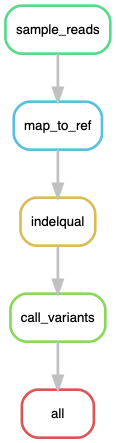

# Variant Calling (including indels)
Given Illumina sequencing data (\*.fastq.gz) and a reference sequence (ref.fasta) this [Snakemake](https://snakemake.readthedocs.io/en/stable/index.html) workflow computes all variants.

## Workflow
- Samples random 200'000 reads (increase speed)
- Maps reads to a reference sequence using [bwa-mem](http://bio-bwa.sourceforge.net/)
- Adds indel qualities to BAM file
- Calls variants (including indels) using [LoFreq](https://csb5.github.io/lofreq/)



## Usage
### Setup
#### Step 1: Install conda
Follow the steps on the [Bioconda website](https://bioconda.github.io/user/install.html#) to install Miniconda and set up Bioconda.

#### Step 2: Install snakemake
It's suggested to install snakemake in a separate conda environment as follows:
```
conda create -n snakemake snakemake=5.5.3
conda activate snakemake
```

#### Step 3: Clone workflow
```
git clone https://github.com/medvir/variant-calling.git
cd variant-calling/
```

#### Step 4: Get your data
Create `raw_data/` folder and copy all `.fastq.gz` sequencing files and the reference sequence `ref.fasta`.  
Those are used as input for the Snakemake workflow.

#### Step 5: Run Snakemake
Try running a dry-run first:  
`snakemake --use-conda -n`  

If there were no issues (all green) you can actually run Snakemake:  
`snakemake --use-conda`  

If you want to run multiple jobs in parallel, you can define the number of jobs with the `-j` flag:  
(this can however in some cases lead to an error, not sure why)  
`snakemake --use-conda -j 4`  

## Notes
- Read clippings are not counted  
- LoFreq sets a minimum coverage of 10 by default  
- duplicated reads are not removed (could be done with [`seqkit rmdup -s`](https://bioinf.shenwei.me/seqkit/usage/#rmdup))
